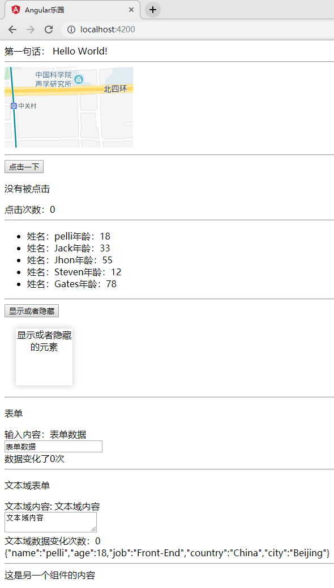
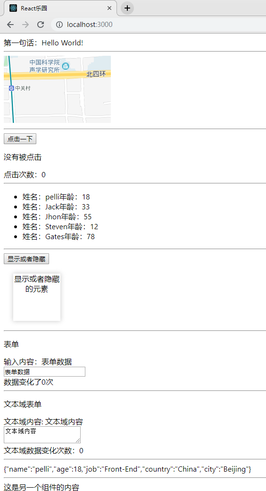
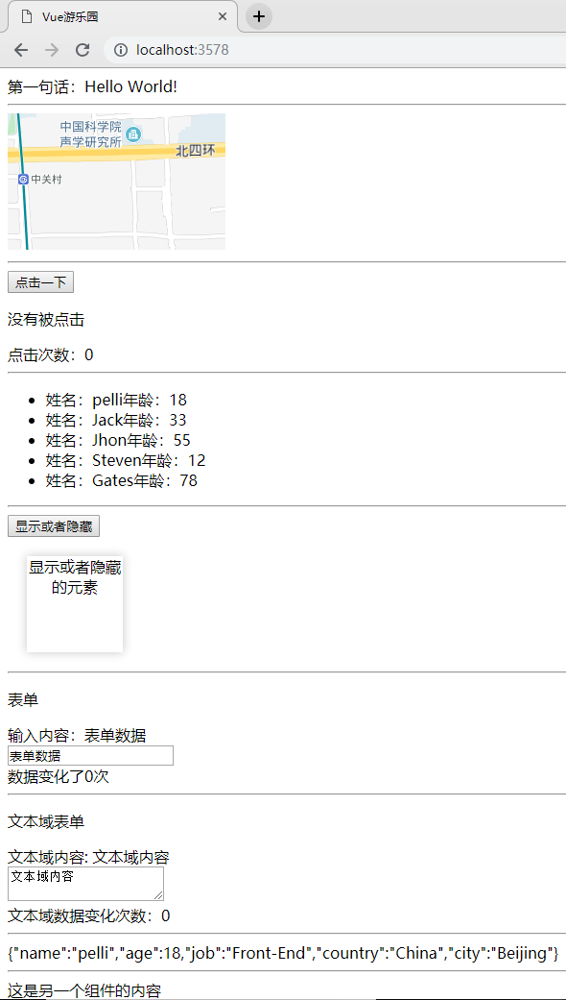
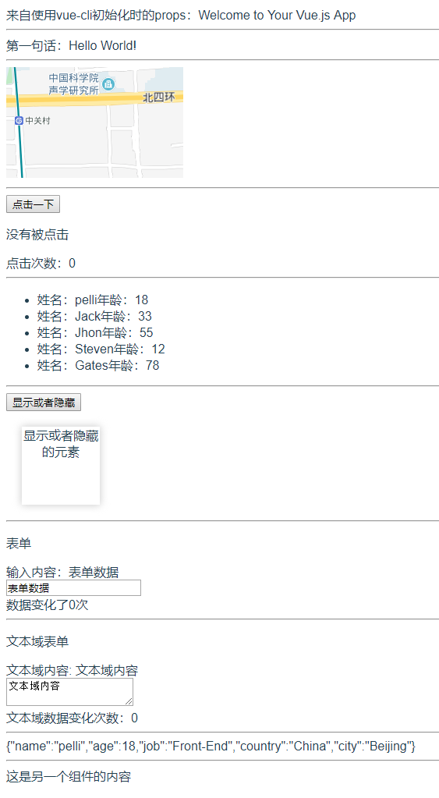
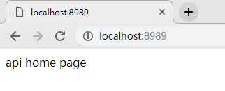
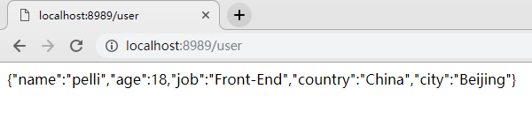

### 三大框架的基本使用

> 以下所有操作全部使用`git bash`进行

**环境依赖**

* Node.js
* NPM
* git
* git bash

**项目说明**

* play-api: 所有项目的api接口提供者: localhost:8989
* play-ng: angular的Demo项目：localhost:4200
* play-react: react的Demo项目: localhost:3000
* play-vue: vue的Demo项目: localhost:3578
* play-vuecli: 使用vue-cli创建的vue项目: localhost:8080

### 开始

下载项目：`git clone https://github.com/pelligit/play-framework.git`

进入项目所在目录：`cd play-framework`

> 使用脚本开始项目

```bash
# 初始化项目
# 安装项目依赖项
$ ./play-init.sh

# 启动项目
$ ./play-start.sh
```

---

> 手动启动项目

```bash
# 开启angular项目
$ cd play-ng 
$ npm install
$ npm start
$ cd ..

# 开启vue项目
$ cd play-vue 
$ npm install
$ npm start
$ cd ..

# 开启react项目
$ cd play-react 
$ npm install
$ npm start
$ cd ..

# 开启vuecli项目
$ cd play-vuecli 
$ npm install
$ npm run serve
$ cd ..

# 开启后台api接口
$ cd play-api 
$ npm install
$ npm start
$ cd ..
```

### 在浏览器中打开项目

* API接口主页：`http://127.0.0.1:8989/`
* API接口user数据：`http://127.0.0.1:8989/user`
* angular项目主页：`http://127.0.0.1:4200`
* react项目主页：`http://127.0.0.1:3000`
* vue项目主页：`http://127.0.0.1:3578`
* vuecli项目主页：`http://127.0.0.1:8080`

### 项目效果

**Angular效果**



**React效果**



**Vue效果**



**Vue效果**



**API主页效果**



**API user接口效果**

